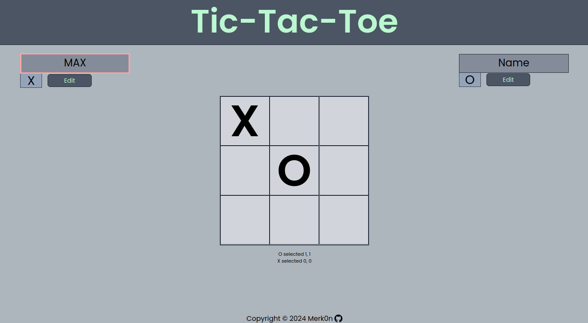
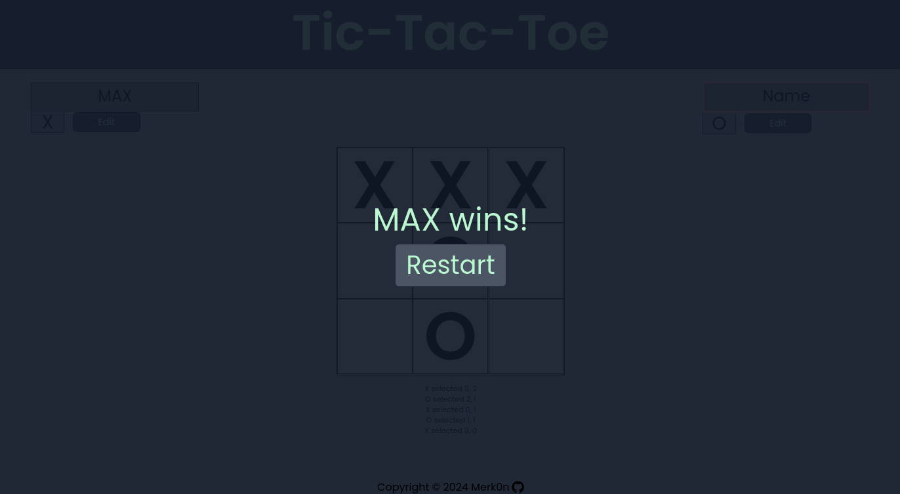
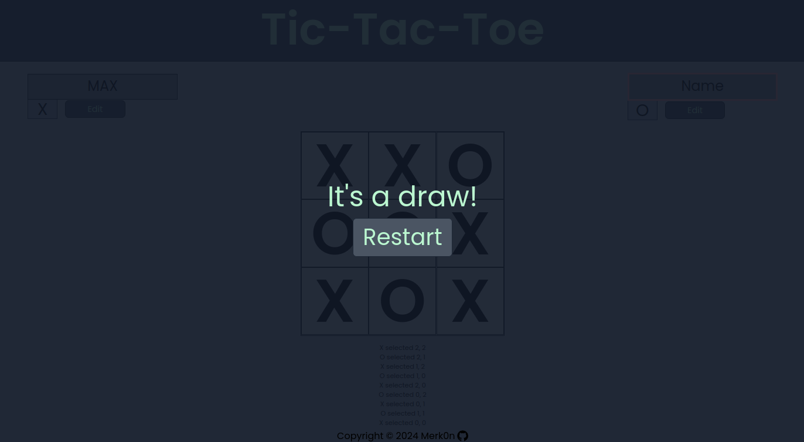

# Tic-Tac-Toe Game
This project is a simple implementation of the classic Tic-Tac-Toe game built with React and styled with Tailwind CSS.

## Demo

**[Live preview](https://merk0n.github.io/tic-tac-toe/)**

game
:--------------------------------------------------:

win           |  draw
:-------------------------:|:-------------------------:
  |  

## Features

- Play Tic-Tac-Toe against another player,
- Possibility to change player name,
- Highlights nickname on move,
- Indicates when a player has won the game,
- Indicates when the game is a draw,
- Allows players to reset the game and start over.

## Technologies Used

- **React**: Used for building the user interface and managing the game state.
- **Tailwind CSS**: Utilized for styling the components and layout of the game.
